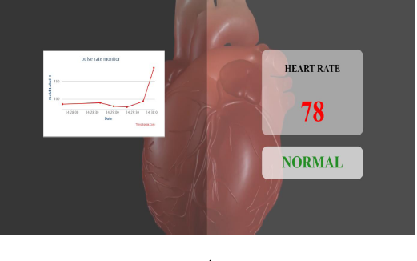

# Iot-based-Heart-Attack-Detection-System

# Components Required
1. Arduino  
2. Heart Beat Sensor 
3. Jumper Wires  

# Working

With the help of heart beat sensor data is captured. 
If any abnormal pattern of Heart rate is noticed the System Alerts the user.

# Result

